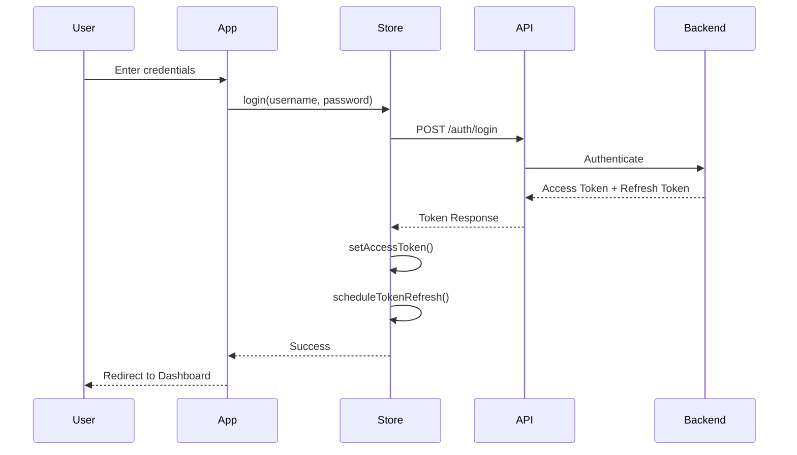
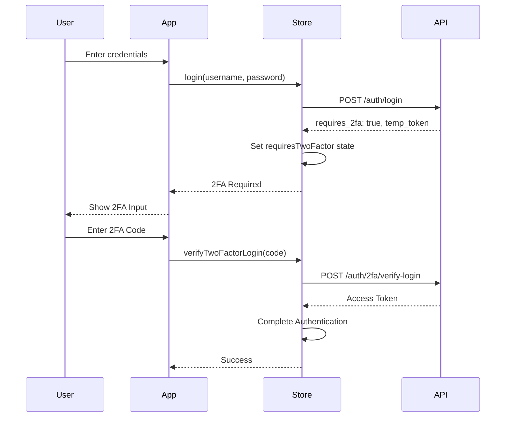

# Authentication Guide

## Overview

The authentication system provides secure user authentication with support for multiple authentication methods including traditional username/password, Two-Factor Authentication (2FA), and WebAuthn/Passkeys.

## Authentication Flow

### Standard Login Flow



### Login with 2FA



## Implementation

### Basic Login

```typescript
import { useAuthStore } from '@/store';
import { useState } from 'react';

function LoginForm() {
  const [username, setUsername] = useState('');
  const [password, setPassword] = useState('');

  const login = useAuthStore((state) => state.login);
  const loading = useAuthStore((state) => state.loading);
  const error = useAuthStore((state) => state.error);

  const handleSubmit = async (e: React.FormEvent) => {
    e.preventDefault();

    const success = await login(username, password);

    if (success) {
      // Redirect to dashboard
      window.location.href = '/dashboard';
    }
  };

  return (
    <form onSubmit={handleSubmit}>
      <input
        type="text"
        value={username}
        onChange={(e) => setUsername(e.target.value)}
        placeholder="Username"
        disabled={loading}
      />
      <input
        type="password"
        value={password}
        onChange={(e) => setPassword(e.target.value)}
        placeholder="Password"
        disabled={loading}
      />
      {error && <div className="error">{error}</div>}
      <button type="submit" disabled={loading}>
        {loading ? 'Logging in...' : 'Login'}
      </button>
    </form>
  );
}
```

### Login with 2FA Support

```typescript
import { useAuthStore } from '@/store';
import { useState } from 'react';

function LoginWithTwoFactor() {
  const [username, setUsername] = useState('');
  const [password, setPassword] = useState('');
  const [twoFactorCode, setTwoFactorCode] = useState('');

  const login = useAuthStore((state) => state.login);
  const verifyTwoFactorLogin = useAuthStore((state) => state.verifyTwoFactorLogin);
  const requiresTwoFactor = useAuthStore((state) => state.requiresTwoFactor);
  const loading = useAuthStore((state) => state.loading);

  const handleLogin = async (e: React.FormEvent) => {
    e.preventDefault();
    await login(username, password);
    // If 2FA is required, requiresTwoFactor will be set to true
  };

  const handleTwoFactorVerify = async (e: React.FormEvent) => {
    e.preventDefault();
    const success = await verifyTwoFactorLogin(twoFactorCode);

    if (success) {
      window.location.href = '/dashboard';
    }
  };

  if (requiresTwoFactor) {
    return (
      <form onSubmit={handleTwoFactorVerify}>
        <h2>Enter 2FA Code</h2>
        <input
          type="text"
          value={twoFactorCode}
          onChange={(e) => setTwoFactorCode(e.target.value)}
          placeholder="000000"
          maxLength={6}
          disabled={loading}
        />
        <button type="submit" disabled={loading}>
          Verify
        </button>
      </form>
    );
  }

  return (
    <form onSubmit={handleLogin}>
      <input
        type="text"
        value={username}
        onChange={(e) => setUsername(e.target.value)}
        placeholder="Username"
      />
      <input
        type="password"
        value={password}
        onChange={(e) => setPassword(e.target.value)}
        placeholder="Password"
      />
      <button type="submit" disabled={loading}>
        Login
      </button>
    </form>
  );
}
```

### Registration

```typescript
import { useAuthStore } from '@/store';
import { useState } from 'react';
import type { CreateUserDto } from '@/types';

function RegisterForm() {
  const [formData, setFormData] = useState<CreateUserDto>({
    username: '',
    email: '',
    password: '',
    first_name: '',
    last_name: '',
  });

  const register = useAuthStore((state) => state.register);
  const loading = useAuthStore((state) => state.loading);
  const error = useAuthStore((state) => state.error);

  const handleSubmit = async (e: React.FormEvent) => {
    e.preventDefault();

    const success = await register(formData);

    if (success) {
      // Redirect to login page
      window.location.href = '/sign-in';
    }
  };

  return (
    <form onSubmit={handleSubmit}>
      <input
        type="text"
        value={formData.username}
        onChange={(e) => setFormData({ ...formData, username: e.target.value })}
        placeholder="Username"
        required
      />
      <input
        type="email"
        value={formData.email}
        onChange={(e) => setFormData({ ...formData, email: e.target.value })}
        placeholder="Email"
        required
      />
      <input
        type="password"
        value={formData.password}
        onChange={(e) => setFormData({ ...formData, password: e.target.value })}
        placeholder="Password"
        required
      />
      <input
        type="text"
        value={formData.first_name}
        onChange={(e) => setFormData({ ...formData, first_name: e.target.value })}
        placeholder="First Name"
        required
      />
      <input
        type="text"
        value={formData.last_name}
        onChange={(e) => setFormData({ ...formData, last_name: e.target.value })}
        placeholder="Last Name"
        required
      />
      {error && <div className="error">{error}</div>}
      <button type="submit" disabled={loading}>
        {loading ? 'Creating Account...' : 'Register'}
      </button>
    </form>
  );
}
```

### Logout

```typescript
import { useAuthStore } from '@/store';

function LogoutButton() {
  const logout = useAuthStore((state) => state.logout);
  const loading = useAuthStore((state) => state.loading);

  const handleLogout = async () => {
    await logout();
    // User will be redirected to /sign-in automatically
  };

  return (
    <button onClick={handleLogout} disabled={loading}>
      {loading ? 'Logging out...' : 'Logout'}
    </button>
  );
}
```

### Protected Routes

```typescript
import { useAuthStore } from '@/store';
import { useEffect } from 'react';
import { useRouter } from 'next/navigation';

function ProtectedPage() {
  const router = useRouter();
  const isAuthenticated = useAuthStore((state) => state.isAuthenticated);
  const isInitializing = useAuthStore((state) => state.isInitializing);

  useEffect(() => {
    if (!isInitializing && !isAuthenticated) {
      router.push('/sign-in');
    }
  }, [isAuthenticated, isInitializing, router]);

  if (isInitializing) {
    return <div>Loading...</div>;
  }

  if (!isAuthenticated) {
    return null;
  }

  return (
    <div>
      <h1>Protected Content</h1>
      {/* Your protected content here */}
    </div>
  );
}
```

### Authentication Initialization

```typescript
'use client';

import { useAuthStore } from '@/store';
import { useEffect, useState } from 'react';

export function AuthInitializer({ children }: { children: React.ReactNode }) {
  const [isReady, setIsReady] = useState(false);
  const initializeAuth = useAuthStore((state) => state.initializeAuth);

  useEffect(() => {
    const init = async () => {
      await initializeAuth();
      setIsReady(true);
    };

    init();
  }, [initializeAuth]);

  if (!isReady) {
    return <div>Initializing...</div>;
  }

  return <>{children}</>;
}
```

## API Reference

### Store Actions

#### `login(username: string, password: string): Promise<boolean>`

Authenticate user with username and password.

**Returns:** `true` if login successful, `false` if 2FA is required or login failed

**Side Effects:**

- Sets `accessToken` and `tokenExpiresAt`
- Sets `isAuthenticated` to `true`
- Schedules automatic token refresh
- Sets `requiresTwoFactor` if 2FA is enabled
- Stores `tempToken` for 2FA verification

#### `logout(): Promise<void>`

End user session and clear all authentication data.

**Side Effects:**

- Clears all tokens
- Clears user information
- Clears query cache
- Redirects to `/sign-in`

#### `register(userData: CreateUserDto): Promise<boolean>`

Create a new user account.

**Returns:** `true` if registration successful

#### `verifyTwoFactorLogin(code: string): Promise<boolean>`

Verify 2FA code during login.

**Returns:** `true` if verification successful

**Prerequisites:** Must be called after `login()` when `requiresTwoFactor` is `true`

### Store State

#### `isAuthenticated: boolean`

Current authentication status (computed from token validity)

#### `loading: boolean`

Loading state for async operations

#### `error: string | null`

Last error message

#### `userInfo: User | null`

Current user information

#### `requiresTwoFactor: boolean`

Whether 2FA verification is required

#### `tempToken: string | null`

Temporary token for 2FA verification

## Error Handling

The authentication system provides detailed error messages:

```typescript
const error = useAuthStore((state) => state.error);

// Common error messages:
// - "Invalid username or password"
// - "Network connection error. Please check your internet connection."
// - "Your session has expired. Please login again."
// - "User already exists with this username or email"
```

Clear errors manually:

```typescript
const clearError = useAuthStore((state) => state.clearError);
clearError();
```

## Security Features

1. **Token Security**
   - Memory-first storage (XSS protection)
   - Encrypted backup storage
   - Token fingerprinting
   - Automatic validation

2. **CSRF Protection**
   - CSRF tokens on all state-changing requests
   - Automatic token refresh

3. **Rate Limiting**
   - Login attempt limiting
   - Automatic backoff on failures

4. **Session Management**
   - Automatic token refresh
   - Session expiry handling
   - Secure logout

## Best Practices

1. **Always handle loading states** - Show loading indicators during authentication
2. **Display error messages** - Show user-friendly error messages
3. **Validate input** - Validate form data before submission
4. **Use TypeScript** - Leverage type safety for user data
5. **Handle 2FA flow** - Check `requiresTwoFactor` state after login
6. **Initialize auth on app start** - Use `AuthInitializer` component
7. **Protect routes** - Check `isAuthenticated` before rendering protected content

## Related Documentation

- [Token Management](./token-management.md)
- [Two-Factor Authentication](./two-factor-auth.md)
- [Passkey Authentication](./passkey-auth.md)
- [Security Best Practices](./security.md)
