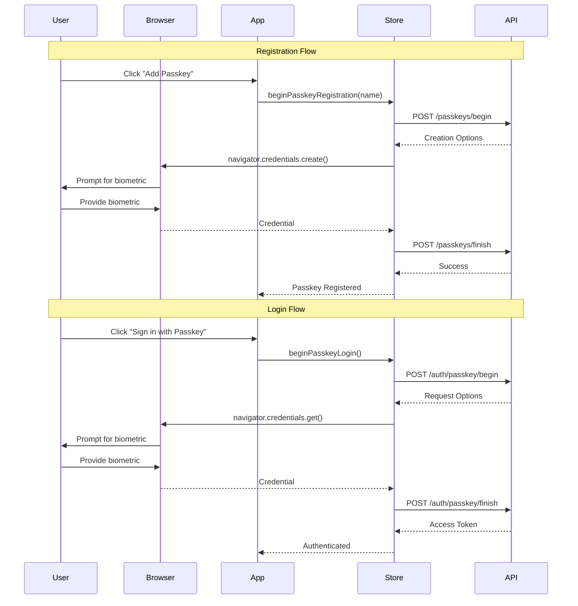

# Passkey Authentication (WebAuthn)

## Overview

Passkey authentication provides passwordless login using WebAuthn/FIDO2 standards. Users can authenticate using biometrics (fingerprint, face recognition) or hardware security keys, offering both enhanced security and improved user experience.

## What are Passkeys?

Passkeys are:

- **Phishing-resistant** - Cannot be stolen or reused
- **Passwordless** - No passwords to remember or manage
- **Biometric** - Use fingerprint, face ID, or PIN
- **Cross-platform** - Work across devices with sync
- **Standards-based** - Built on WebAuthn/FIDO2

## How It Works



## Implementation

### Register a Passkey

```typescript
import { useAuthStore } from '@/store';
import { useState } from 'react';
import { startRegistration } from '@simplewebauthn/browser';

function RegisterPasskey() {
  const [name, setName] = useState('');

  const beginPasskeyRegistration = useAuthStore((state) => state.beginPasskeyRegistration);
  const finishPasskeyRegistration = useAuthStore((state) => state.finishPasskeyRegistration);
  const loading = useAuthStore((state) => state.loading);
  const error = useAuthStore((state) => state.error);

  const handleRegister = async (e: React.FormEvent) => {
    e.preventDefault();

    try {
      // Step 1: Get registration options from server
      await beginPasskeyRegistration(name);

      const options = useAuthStore.getState().passkeyRegistrationOptions;

      if (!options) {
        throw new Error('Failed to get registration options');
      }

      // Step 2: Prompt user for biometric
      const credential = await startRegistration(options);

      // Step 3: Send credential to server
      const success = await finishPasskeyRegistration(name, credential);

      if (success) {
        alert('Passkey registered successfully!');
        setName('');
      }
    } catch (err) {
      console.error('Passkey registration failed:', err);

      if (err.name === 'NotAllowedError') {
        alert('Registration cancelled or not allowed');
      } else if (err.name === 'NotSupportedError') {
        alert('Passkeys are not supported on this device');
      } else {
        alert('Failed to register passkey');
      }
    }
  };

  return (
    <form onSubmit={handleRegister}>
      <h2>Register Passkey</h2>

      <input
        type="text"
        value={name}
        onChange={(e) => setName(e.target.value)}
        placeholder="Passkey name (e.g., 'My iPhone')"
        required
      />

      {error && <div className="error">{error}</div>}

      <button type="submit" disabled={loading}>
        {loading ? 'Registering...' : 'Register Passkey'}
      </button>
    </form>
  );
}
```

### Login with Passkey

```typescript
import { useAuthStore } from '@/store';
import { startAuthentication } from '@simplewebauthn/browser';

function PasskeyLogin() {
  const beginPasskeyLogin = useAuthStore((state) => state.beginPasskeyLogin);
  const finishPasskeyLogin = useAuthStore((state) => state.finishPasskeyLogin);
  const loading = useAuthStore((state) => state.loading);
  const error = useAuthStore((state) => state.error);

  const handlePasskeyLogin = async () => {
    try {
      // Step 1: Get authentication options from server
      await beginPasskeyLogin();

      const options = useAuthStore.getState().passkeyLoginOptions;

      if (!options) {
        throw new Error('Failed to get login options');
      }

      // Step 2: Prompt user for biometric
      const credential = await startAuthentication(options);

      // Step 3: Send credential to server and authenticate
      const success = await finishPasskeyLogin(credential);

      if (success) {
        window.location.href = '/dashboard';
      }
    } catch (err) {
      console.error('Passkey login failed:', err);

      if (err.name === 'NotAllowedError') {
        alert('Login cancelled or not allowed');
      } else if (err.name === 'NotSupportedError') {
        alert('Passkeys are not supported on this device');
      } else {
        alert('Failed to login with passkey');
      }
    }
  };

  return (
    <div>
      <h2>Sign in with Passkey</h2>

      {error && <div className="error">{error}</div>}

      <button onClick={handlePasskeyLogin} disabled={loading}>
        {loading ? 'Signing in...' : 'Sign in with Passkey'}
      </button>
    </div>
  );
}
```

### List Registered Passkeys

```typescript
import { useAuthStore } from '@/store';
import { useEffect } from 'react';

function PasskeyList() {
  const listPasskeys = useAuthStore((state) => state.listPasskeys);
  const deletePasskey = useAuthStore((state) => state.deletePasskey);
  const registeredPasskeys = useAuthStore((state) => state.registeredPasskeys);
  const loading = useAuthStore((state) => state.loading);

  useEffect(() => {
    listPasskeys();
  }, [listPasskeys]);

  const handleDelete = async (id: string, name: string) => {
    if (confirm(`Delete passkey "${name}"?`)) {
      const success = await deletePasskey(id);

      if (success) {
        alert('Passkey deleted successfully');
      }
    }
  };

  if (loading && registeredPasskeys.length === 0) {
    return <div>Loading passkeys...</div>;
  }

  if (registeredPasskeys.length === 0) {
    return <div>No passkeys registered</div>;
  }

  return (
    <div>
      <h2>Your Passkeys</h2>
      <ul>
        {registeredPasskeys.map((passkey) => (
          <li key={passkey.id}>
            <div>
              <strong>{passkey.name}</strong>
              <p>Created: {new Date(passkey.created_at).toLocaleDateString()}</p>
              <p>Last used: {passkey.last_used ? new Date(passkey.last_used).toLocaleDateString() : 'Never'}</p>
            </div>
            <button
              onClick={() => handleDelete(passkey.id, passkey.name)}
              disabled={loading}
            >
              Delete
            </button>
          </li>
        ))}
      </ul>
    </div>
  );
}
```

### Complete Passkey Management Component

```typescript
import { useAuthStore } from '@/store';
import { useState, useEffect } from 'react';
import { startRegistration } from '@simplewebauthn/browser';

function PasskeyManagement() {
  const [name, setName] = useState('');
  const [showRegister, setShowRegister] = useState(false);

  const beginPasskeyRegistration = useAuthStore((state) => state.beginPasskeyRegistration);
  const finishPasskeyRegistration = useAuthStore((state) => state.finishPasskeyRegistration);
  const listPasskeys = useAuthStore((state) => state.listPasskeys);
  const deletePasskey = useAuthStore((state) => state.deletePasskey);
  const clearPasskeyState = useAuthStore((state) => state.clearPasskeyState);

  const registeredPasskeys = useAuthStore((state) => state.registeredPasskeys);
  const loading = useAuthStore((state) => state.loading);
  const error = useAuthStore((state) => state.error);

  useEffect(() => {
    listPasskeys();

    return () => {
      clearPasskeyState();
    };
  }, [listPasskeys, clearPasskeyState]);

  const handleRegister = async (e: React.FormEvent) => {
    e.preventDefault();

    try {
      await beginPasskeyRegistration(name);

      const options = useAuthStore.getState().passkeyRegistrationOptions;
      if (!options) throw new Error('No registration options');

      const credential = await startRegistration(options);
      const success = await finishPasskeyRegistration(name, credential);

      if (success) {
        setName('');
        setShowRegister(false);
        await listPasskeys(); // Refresh list
      }
    } catch (err) {
      console.error('Registration failed:', err);
    }
  };

  const handleDelete = async (id: string, name: string) => {
    if (confirm(`Delete passkey "${name}"?`)) {
      const success = await deletePasskey(id);
      if (success) {
        await listPasskeys(); // Refresh list
      }
    }
  };

  return (
    <div>
      <h2>Passkey Management</h2>

      {error && <div className="error">{error}</div>}

      {!showRegister ? (
        <button onClick={() => setShowRegister(true)}>
          Add New Passkey
        </button>
      ) : (
        <form onSubmit={handleRegister}>
          <input
            type="text"
            value={name}
            onChange={(e) => setName(e.target.value)}
            placeholder="Passkey name"
            required
          />
          <button type="submit" disabled={loading}>
            Register
          </button>
          <button
            type="button"
            onClick={() => setShowRegister(false)}
            disabled={loading}
          >
            Cancel
          </button>
        </form>
      )}

      <h3>Registered Passkeys</h3>
      {loading && registeredPasskeys.length === 0 ? (
        <div>Loading...</div>
      ) : registeredPasskeys.length === 0 ? (
        <div>No passkeys registered</div>
      ) : (
        <ul>
          {registeredPasskeys.map((passkey) => (
            <li key={passkey.id}>
              <div>
                <strong>{passkey.name}</strong>
                <p>Created: {new Date(passkey.created_at).toLocaleDateString()}</p>
              </div>
              <button
                onClick={() => handleDelete(passkey.id, passkey.name)}
                disabled={loading}
              >
                Delete
              </button>
            </li>
          ))}
        </ul>
      )}
    </div>
  );
}
```

## API Reference

### Store Actions

#### `beginPasskeyRegistration(name: string): Promise<void>`

Start passkey registration process.

**Parameters:**

- `name`: Friendly name for the passkey (e.g., "My iPhone")

**Side Effects:**

- Sets `passkeyRegistrationOptions` with WebAuthn creation options

#### `finishPasskeyRegistration(name: string, credential: any): Promise<boolean>`

Complete passkey registration.

**Parameters:**

- `name`: Passkey name
- `credential`: WebAuthn credential from `startRegistration()`

**Returns:** `true` if registration successful

#### `beginPasskeyLogin(username?: string): Promise<void>`

Start passkey login process.

**Parameters:**

- `username`: Optional username for account-specific login

**Side Effects:**

- Sets `passkeyLoginOptions` with WebAuthn request options

#### `finishPasskeyLogin(credential: any): Promise<boolean>`

Complete passkey login.

**Parameters:**

- `credential`: WebAuthn credential from `startAuthentication()`

**Returns:** `true` if login successful

**Side Effects:**

- Sets `accessToken` and completes authentication
- Schedules token refresh

#### `listPasskeys(): Promise<void>`

Fetch list of registered passkeys.

**Side Effects:**

- Sets `registeredPasskeys` array

#### `deletePasskey(id: string): Promise<boolean>`

Delete a registered passkey.

**Parameters:**

- `id`: Passkey ID

**Returns:** `true` if deletion successful

**Side Effects:**

- Removes passkey from `registeredPasskeys` array

#### `clearPasskeyState(): void`

Clear passkey-related state.

**Side Effects:**

- Clears `passkeyRegistrationOptions`
- Clears `passkeyLoginOptions`

### Store State

#### `passkeyRegistrationOptions: PublicKeyCredentialCreationOptions | null`

WebAuthn creation options for registration

#### `passkeyLoginOptions: PublicKeyCredentialRequestOptions | null`

WebAuthn request options for login

#### `registeredPasskeys: Passkey[]`

Array of registered passkeys

```typescript
interface Passkey {
  id: string;
  name: string;
  created_at: string;
  last_used: string | null;
}
```

## Browser Support

### Checking Support

```typescript
function checkPasskeySupport() {
  // Check if WebAuthn is supported
  if (!window.PublicKeyCredential) {
    return {
      supported: false,
      reason: 'WebAuthn not supported',
    };
  }

  // Check if platform authenticator is available
  PublicKeyCredential.isUserVerifyingPlatformAuthenticatorAvailable().then(
    (available) => {
      if (available) {
        return {
          supported: true,
          type: 'platform', // Built-in biometric
        };
      } else {
        return {
          supported: true,
          type: 'cross-platform', // Security key
        };
      }
    }
  );
}
```

### Conditional UI

```typescript
function PasskeyButton() {
  const [supported, setSupported] = useState(false);

  useEffect(() => {
    if (window.PublicKeyCredential) {
      PublicKeyCredential.isUserVerifyingPlatformAuthenticatorAvailable()
        .then(setSupported);
    }
  }, []);

  if (!supported) {
    return null; // Hide button if not supported
  }

  return (
    <button onClick={handlePasskeyLogin}>
      Sign in with Passkey
    </button>
  );
}
```

## Error Handling

### Common Errors

```typescript
try {
  await finishPasskeyLogin(credential);
} catch (err) {
  switch (err.name) {
    case 'NotAllowedError':
      // User cancelled or timeout
      alert('Authentication cancelled');
      break;

    case 'NotSupportedError':
      // Feature not supported
      alert('Passkeys not supported on this device');
      break;

    case 'InvalidStateError':
      // Authenticator already registered
      alert('This passkey is already registered');
      break;

    case 'SecurityError':
      // Security requirements not met
      alert('Security error. Please try again.');
      break;

    default:
      alert('Authentication failed');
  }
}
```

## Security Considerations

### 1. Phishing Resistance

Passkeys are bound to the origin (domain):

- Cannot be used on phishing sites
- Automatically validates the domain

### 2. No Shared Secrets

Unlike passwords:

- Private key never leaves the device
- Server only stores public key
- Cannot be stolen in a data breach

### 3. User Verification

Passkeys require user verification:

- Biometric (fingerprint, face)
- Device PIN
- Hardware security key

### 4. Attestation

Server can verify authenticator authenticity:

- Ensures genuine hardware
- Prevents software emulation

## Best Practices

### 1. Provide Fallback Authentication

```typescript
// Always offer password login as fallback
<div>
  <button onClick={handlePasskeyLogin}>
    Sign in with Passkey
  </button>
  <button onClick={() => setShowPasswordLogin(true)}>
    Sign in with Password
  </button>
</div>
```

### 2. Clear Naming

```typescript
// Use descriptive names for passkeys
"John's iPhone 13";
'Work Laptop - MacBook Pro';
'YubiKey 5C';
```

### 3. Handle Timeouts

```typescript
// WebAuthn operations have timeouts (usually 60s)
const TIMEOUT_MS = 60000;

setTimeout(() => {
  alert('Authentication timeout. Please try again.');
}, TIMEOUT_MS);
```

### 4. Progressive Enhancement

```typescript
// Check support before showing passkey options
if (window.PublicKeyCredential) {
  // Show passkey UI
} else {
  // Show only password login
}
```

### 5. Clear Error Messages

```typescript
// Provide user-friendly error messages
if (err.name === 'NotAllowedError') {
  return 'Authentication was cancelled. Please try again.';
} else if (err.name === 'NotSupportedError') {
  return 'Passkeys are not supported on this device. Please use password login.';
}
```

## Testing

### Test Registration

```typescript
// 1. Begin registration
await beginPasskeyRegistration('Test Passkey');

// 2. Check options
const options = useAuthStore.getState().passkeyRegistrationOptions;
expect(options).toBeDefined();
expect(options.challenge).toBeDefined();

// 3. Simulate credential creation
const credential = await startRegistration(options);

// 4. Finish registration
const success = await finishPasskeyRegistration('Test Passkey', credential);
expect(success).toBe(true);
```

### Test Login

```typescript
// 1. Begin login
await beginPasskeyLogin();

// 2. Check options
const options = useAuthStore.getState().passkeyLoginOptions;
expect(options).toBeDefined();

// 3. Simulate authentication
const credential = await startAuthentication(options);

// 4. Finish login
const success = await finishPasskeyLogin(credential);
expect(success).toBe(true);
expect(isAuthenticated).toBe(true);
```

## Related Documentation

- [Authentication Guide](./authentication.md)
- [Two-Factor Authentication](./two-factor-auth.md)
- [Security Best Practices](./security.md)
- [WebAuthn Specification](https://www.w3.org/TR/webauthn-2/)
