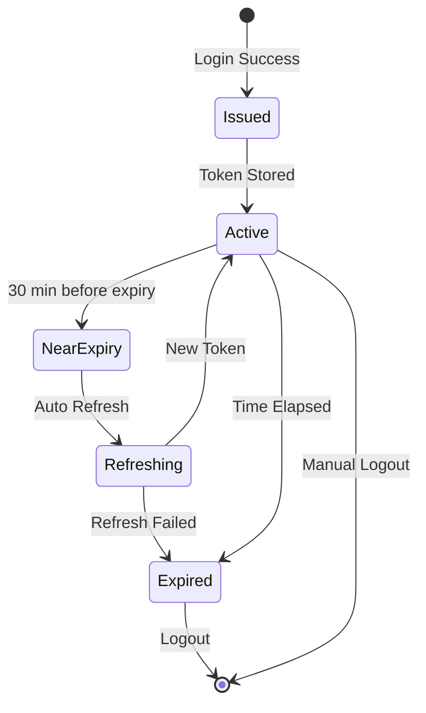
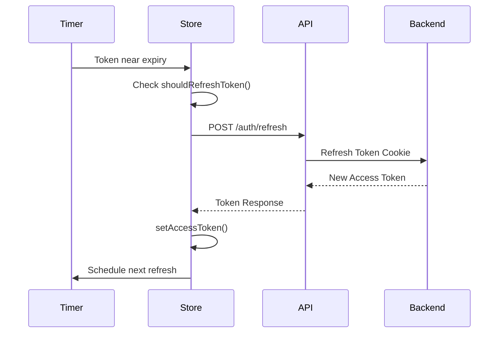

# Token Management

## Overview

The token management system provides secure storage, validation, and lifecycle management for JWT access tokens. It implements multiple layers of security to protect against common vulnerabilities like XSS, token theft, and session hijacking.

## Architecture

### Token Storage Strategy

The system uses a **memory-first** storage strategy with encrypted backup:

1. **Primary Storage (Memory)** - Fastest access, cleared on page refresh
2. **Backup Storage (Encrypted)** - Survives page refresh, encrypted at rest
3. **Never localStorage** - Avoids XSS vulnerabilities

```typescript
// Token storage flow
setAccessToken(token)
  → Store in memory (immediate)
  → Encrypt and store in secureStorage (async backup)
  → Register with tokenSecurity (fingerprinting)
```

### Token Lifecycle



## Token Manager

The `TokenManager` class handles all token operations:

### Setting Tokens

```typescript
import { useAuthStore } from '@/store';

// Set token with automatic expiry calculation
const setAccessToken = useAuthStore((state) => state.setAccessToken);
setAccessToken('eyJhbGciOiJIUzI1NiIsInR5cCI6IkpXVCJ9...');

// Set token with explicit expiry time (from server)
const setAccessTokenWithExpiry = useAuthStore(
  (state) => state.setAccessTokenWithExpiry
);
setAccessTokenWithExpiry('eyJhbGciOiJIUzI1NiIsInR5cCI6IkpXVCJ9...', 14400); // 4 hours
```

### Getting Tokens

```typescript
import { tokenManager } from '@/store/auth';

// Async (checks all storage layers)
const token = await tokenManager.getAuthToken();

// Sync (memory only, faster)
const token = tokenManager.getAuthTokenSync();
```

### Clearing Tokens

```typescript
import { useAuthStore } from '@/store';

// Clear access token only
const clearAccessToken = useAuthStore((state) => state.clearAccessToken);
clearAccessToken();

// Clear all tokens and security data
import { tokenManager } from '@/store/auth';
tokenManager.clearAll();
```

## Token Refresh

### Automatic Refresh

Tokens are automatically refreshed when they approach expiry:

```typescript
// Configuration
const AUTH_CONFIG = {
  REFRESH_BUFFER: 1800, // Refresh 30 min before expiry
  MAX_REFRESH_RETRIES: 3, // Max retry attempts
  RETRY_DELAY: 2000, // Delay between retries (ms)
};
```

### Refresh Flow



### Manual Refresh

```typescript
import { useAuthStore } from '@/store';

// Check if refresh is needed
const shouldRefresh = useAuthStore((state) => state.shouldRefreshToken());

if (shouldRefresh) {
  // Manually trigger refresh
  const refreshToken = useAuthStore((state) => state.refreshToken);
  await refreshToken();
}
```

### Refresh with Retry

```typescript
import { useAuthStore } from '@/store';

// Refresh with automatic retry on failure
const refreshTokenIfNeeded = useAuthStore(
  (state) => state.refreshTokenIfNeeded
);
const success = await refreshTokenIfNeeded();

if (!success) {
  // Refresh failed after retries, user will be logged out
  console.error('Token refresh failed');
}
```

## Token Validation

### Expiry Checking

```typescript
import { useAuthStore } from '@/store';

// Check if token is expired
const isExpired = useAuthStore((state) => state.isTokenExpired());

// Check if token is near expiry (within REFRESH_BUFFER)
const isNearExpiry = useAuthStore((state) => state.isTokenNearExpiry());

// Check if token should be refreshed
const shouldRefresh = useAuthStore((state) => state.shouldRefreshToken());
```

### Token Security Validation

The system validates tokens against multiple security criteria:

```typescript
import { tokenSecurity } from '@/store/auth';

// Validate token (checks fingerprint, expiry, revocation)
const isValid = tokenSecurity.validateToken(token);

// Check if token needs rotation (security policy)
const needsRotation = tokenSecurity.needsRotation(token);

// Get token security stats
const stats = tokenSecurity.getTokenStats(token);
console.log(stats);
// {
//   fingerprint: "abc123...",
//   issuedAt: 1234567890,
//   lastUsed: 1234567900,
//   useCount: 42
// }
```

## Token Security Features

### 1. Token Fingerprinting

Each token is fingerprinted to detect theft:

```typescript
// Automatic fingerprinting on token registration
tokenSecurity.registerToken(token);

// Validation checks fingerprint match
const isValid = tokenSecurity.validateToken(token);
```

### 2. Token Rotation

Tokens are rotated based on security policies:

```typescript
// Check if rotation is needed
const needsRotation = tokenManager.needsRotation();

if (needsRotation) {
  // Trigger refresh to get new token
  await refreshToken();
}
```

### 3. Token Revocation

Tokens can be revoked immediately:

```typescript
import { tokenSecurity } from '@/store/auth';

// Revoke a specific token
tokenSecurity.revokeToken(token);

// Clear all tokens and security data
tokenSecurity.clearAll();
```

### 4. Encrypted Storage

Backup storage uses encryption:

```typescript
import { secureStorage } from '@/store/auth';

// Store encrypted data
await secureStorage.setItem('key', 'value', {
  encrypt: true,
  memoryOnly: false,
  expiresIn: 3600, // 1 hour
});

// Retrieve and decrypt
const value = await secureStorage.getItem('key');
```

## Token Helpers

### Extract Expiry from JWT

```typescript
import { useAuthStore } from '@/store';

const getTokenExpiryFromJWT = useAuthStore(
  (state) => state.getTokenExpiryFromJWT
);
const expiryTimestamp = getTokenExpiryFromJWT(token);

console.log('Token expires at:', new Date(expiryTimestamp));
```

### Calculate Time Until Expiry

```typescript
const tokenExpiresAt = useAuthStore((state) => state.tokenExpiresAt);

if (tokenExpiresAt) {
  const timeUntilExpiry = tokenExpiresAt - Date.now();
  const minutesUntilExpiry = Math.floor(timeUntilExpiry / 1000 / 60);

  console.log(`Token expires in ${minutesUntilExpiry} minutes`);
}
```

## Refresh Mutex

Prevents concurrent token refresh requests:

```typescript
import { refreshMutex } from '@/store/auth';

// Acquire lock before refresh
const release = await refreshMutex.acquire();

try {
  // Perform refresh
  await refreshToken();
} finally {
  // Always release lock
  release();
}
```

## Configuration

### Token Settings

```typescript
export const AUTH_CONFIG = {
  // Token refresh settings
  REFRESH_BUFFER: 1800, // 30 minutes before expiry
  MAX_REFRESH_RETRIES: 3, // Max retry attempts
  RETRY_DELAY: 2000, // Delay between retries (ms)

  // Token lifetime
  ACCESS_TOKEN_MAX_AGE: 14400, // 4 hours (from server)
  REFRESH_TOKEN_MAX_AGE: 6, // 6 days (cookie expiry)

  // Storage
  STORAGE_KEY: 'auth-storage', // LocalStorage key
  COOKIE_KEY: 'isAuthenticated', // Cookie name
};
```

### Customizing Refresh Behavior

```typescript
// Adjust refresh buffer (time before expiry to refresh)
AUTH_CONFIG.REFRESH_BUFFER = 3600; // 1 hour

// Adjust retry settings
AUTH_CONFIG.MAX_REFRESH_RETRIES = 5;
AUTH_CONFIG.RETRY_DELAY = 3000; // 3 seconds
```

## Best Practices

### 1. Never Store Tokens in localStorage Directly

```typescript
// ❌ BAD - Vulnerable to XSS
localStorage.setItem('token', token);

// ✅ GOOD - Use tokenManager
const setAccessToken = useAuthStore((state) => state.setAccessToken);
setAccessToken(token);
```

### 2. Always Validate Tokens Before Use

```typescript
// ❌ BAD - Using token without validation
const token = tokenManager.getAuthTokenSync();
fetch('/api/data', {
  headers: { Authorization: `Bearer ${token}` },
});

// ✅ GOOD - Validate first
const token = await tokenManager.getAuthToken();
if (token && tokenSecurity.validateToken(token)) {
  fetch('/api/data', {
    headers: { Authorization: `Bearer ${token}` },
  });
}
```

### 3. Handle Token Expiry Gracefully

```typescript
// ✅ GOOD - Check and refresh if needed
const refreshTokenIfNeeded = useAuthStore(
  (state) => state.refreshTokenIfNeeded
);
const success = await refreshTokenIfNeeded();

if (success) {
  // Proceed with request
} else {
  // Redirect to login
  window.location.href = '/sign-in';
}
```

### 4. Clear Tokens on Logout

```typescript
// ✅ GOOD - Complete cleanup
const logout = useAuthStore((state) => state.logout);
await logout(); // Clears all tokens and security data
```

### 5. Use Automatic Refresh

```typescript
// ✅ GOOD - Let the system handle refresh
const scheduleTokenRefresh = useAuthStore(
  (state) => state.scheduleTokenRefresh
);
scheduleTokenRefresh(); // Called automatically after login
```

## Monitoring and Debugging

### Token Status

```typescript
import { useAuthStore, tokenManager } from '@/store';

// Check authentication status
const isAuthenticated = useAuthStore((state) => state.isAuthenticated);
console.log('Authenticated:', isAuthenticated);

// Check token expiry
const tokenExpiresAt = useAuthStore((state) => state.tokenExpiresAt);
console.log('Token expires at:', new Date(tokenExpiresAt));

// Get security stats
const stats = tokenManager.getSecurityStats();
console.log('Security stats:', stats);
```

### Debug Logging

Enable debug logging to track token operations:

```typescript
// Token operations are logged with [TokenManager] prefix
// Refresh operations are logged with [TokenRefresh] prefix
// Security operations are logged with [TokenSecurity] prefix

// Example logs:
// [TokenManager] Setting auth token
// [TokenManager] Token expires in 14400s (240 minutes)
// [TokenRefresh] Token refresh scheduled for 12600000ms
// [TokenSecurity] Token registered with fingerprint: abc123...
```

## Error Handling

### Common Errors

```typescript
try {
  await refreshToken();
} catch (error) {
  if (error.message.includes('Network')) {
    // Network error - retry or show offline message
  } else if (error.message.includes('401')) {
    // Unauthorized - redirect to login
    window.location.href = '/sign-in';
  } else {
    // Other error - show error message
    console.error('Token refresh failed:', error);
  }
}
```

### Handling Refresh Failures

```typescript
const refreshTokenIfNeeded = useAuthStore(
  (state) => state.refreshTokenIfNeeded
);

// Refresh with retry
const success = await refreshTokenIfNeeded(0); // retryCount = 0

if (!success) {
  // All retries exhausted
  const handleAuthFailure = useAuthStore((state) => state.handleAuthFailure);
  handleAuthFailure(); // Clears tokens and redirects to login
}
```

## Related Documentation

- [Authentication Guide](./authentication.md)
- [Security Best Practices](./security.md)
- [API Reference](./api-reference.md)
