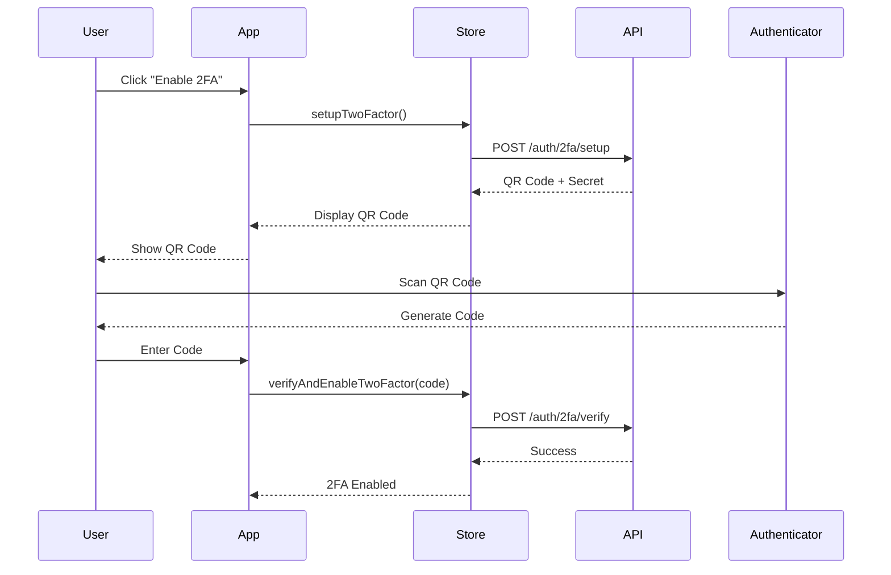

# Two-Factor Authentication (2FA)

## Overview

The Two-Factor Authentication system adds an extra layer of security using Time-based One-Time Passwords (TOTP). Users can enable 2FA using authenticator apps like Google Authenticator, Authy, or Microsoft Authenticator.

## How It Works

2FA uses the TOTP (Time-based One-Time Password) algorithm:

1. Server generates a secret key
2. Secret is shared with user via QR code
3. User scans QR code with authenticator app
4. App generates 6-digit codes that change every 30 seconds
5. User enters code to verify identity

## Setup Flow



## Implementation

### Enable 2FA

```typescript
import { useAuthStore } from '@/store';
import { useState } from 'react';
import QRCode from 'qrcode.react';

function EnableTwoFactor() {
  const [verificationCode, setVerificationCode] = useState('');

  const setupTwoFactor = useAuthStore((state) => state.setupTwoFactor);
  const verifyAndEnableTwoFactor = useAuthStore((state) => state.verifyAndEnableTwoFactor);
  const twoFactorSetupData = useAuthStore((state) => state.twoFactorSetupData);
  const loading = useAuthStore((state) => state.loading);

  const handleSetup = async () => {
    await setupTwoFactor();
    // twoFactorSetupData will be populated with QR code and secret
  };

  const handleVerify = async (e: React.FormEvent) => {
    e.preventDefault();

    const success = await verifyAndEnableTwoFactor(verificationCode);

    if (success) {
      alert('2FA enabled successfully!');
    }
  };

  if (!twoFactorSetupData) {
    return (
      <button onClick={handleSetup} disabled={loading}>
        Enable 2FA
      </button>
    );
  }

  return (
    <div>
      <h2>Scan QR Code</h2>
      <QRCode value={twoFactorSetupData.qr_code_url} size={256} />

      <p>Or enter this secret manually:</p>
      <code>{twoFactorSetupData.secret}</code>

      <form onSubmit={handleVerify}>
        <input
          type="text"
          value={verificationCode}
          onChange={(e) => setVerificationCode(e.target.value)}
          placeholder="Enter 6-digit code"
          maxLength={6}
          pattern="[0-9]{6}"
          required
        />
        <button type="submit" disabled={loading}>
          Verify and Enable
        </button>
      </form>
    </div>
  );
}
```

### Disable 2FA

```typescript
import { useAuthStore } from '@/store';
import { useState } from 'react';

function DisableTwoFactor() {
  const [password, setPassword] = useState('');
  const [code, setCode] = useState('');

  const disableTwoFactor = useAuthStore((state) => state.disableTwoFactor);
  const loading = useAuthStore((state) => state.loading);

  const handleSubmit = async (e: React.FormEvent) => {
    e.preventDefault();

    const success = await disableTwoFactor(password, code);

    if (success) {
      alert('2FA disabled successfully');
    }
  };

  return (
    <form onSubmit={handleSubmit}>
      <h2>Disable 2FA</h2>
      <p>Enter your password and current 2FA code to disable</p>

      <input
        type="password"
        value={password}
        onChange={(e) => setPassword(e.target.value)}
        placeholder="Password"
        required
      />

      <input
        type="text"
        value={code}
        onChange={(e) => setCode(e.target.value)}
        placeholder="2FA Code"
        maxLength={6}
        pattern="[0-9]{6}"
        required
      />

      <button type="submit" disabled={loading}>
        Disable 2FA
      </button>
    </form>
  );
}
```

### Login with 2FA

```typescript
import { useAuthStore } from '@/store';
import { useState, useEffect } from 'react';

function LoginWithTwoFactor() {
  const [username, setUsername] = useState('');
  const [password, setPassword] = useState('');
  const [twoFactorCode, setTwoFactorCode] = useState('');

  const login = useAuthStore((state) => state.login);
  const verifyTwoFactorLogin = useAuthStore((state) => state.verifyTwoFactorLogin);
  const clearTwoFactorState = useAuthStore((state) => state.clearTwoFactorState);
  const requiresTwoFactor = useAuthStore((state) => state.requiresTwoFactor);
  const loading = useAuthStore((state) => state.loading);
  const error = useAuthStore((state) => state.error);

  // Clear 2FA state on unmount
  useEffect(() => {
    return () => {
      clearTwoFactorState();
    };
  }, [clearTwoFactorState]);

  const handleLogin = async (e: React.FormEvent) => {
    e.preventDefault();
    await login(username, password);
  };

  const handleTwoFactorVerify = async (e: React.FormEvent) => {
    e.preventDefault();

    const success = await verifyTwoFactorLogin(twoFactorCode);

    if (success) {
      window.location.href = '/dashboard';
    }
  };

  // Show 2FA input if required
  if (requiresTwoFactor) {
    return (
      <form onSubmit={handleTwoFactorVerify}>
        <h2>Two-Factor Authentication</h2>
        <p>Enter the 6-digit code from your authenticator app</p>

        <input
          type="text"
          value={twoFactorCode}
          onChange={(e) => setTwoFactorCode(e.target.value)}
          placeholder="000000"
          maxLength={6}
          pattern="[0-9]{6}"
          autoFocus
          required
        />

        {error && <div className="error">{error}</div>}

        <button type="submit" disabled={loading}>
          {loading ? 'Verifying...' : 'Verify'}
        </button>

        <button
          type="button"
          onClick={clearTwoFactorState}
          disabled={loading}
        >
          Back to Login
        </button>
      </form>
    );
  }

  // Show login form
  return (
    <form onSubmit={handleLogin}>
      <h2>Login</h2>

      <input
        type="text"
        value={username}
        onChange={(e) => setUsername(e.target.value)}
        placeholder="Username"
        required
      />

      <input
        type="password"
        value={password}
        onChange={(e) => setPassword(e.target.value)}
        placeholder="Password"
        required
      />

      {error && <div className="error">{error}</div>}

      <button type="submit" disabled={loading}>
        {loading ? 'Logging in...' : 'Login'}
      </button>
    </form>
  );
}
```

## API Reference

### Store Actions

#### `setupTwoFactor(): Promise<void>`

Initialize 2FA setup and get QR code.

**Side Effects:**

- Sets `twoFactorSetupData` with QR code and secret
- Sets `loading` state

**Response Data:**

```typescript
{
  qr_code_url: string; // otpauth:// URL for QR code
  secret: string; // Base32 encoded secret
}
```

#### `verifyAndEnableTwoFactor(code: string): Promise<boolean>`

Verify TOTP code and enable 2FA.

**Parameters:**

- `code`: 6-digit TOTP code from authenticator app

**Returns:** `true` if verification successful

**Side Effects:**

- Clears `twoFactorSetupData` on success
- Updates user's 2FA status

#### `disableTwoFactor(password: string, code: string): Promise<boolean>`

Disable 2FA for the user.

**Parameters:**

- `password`: User's current password
- `code`: Current 6-digit TOTP code

**Returns:** `true` if disabled successfully

**Side Effects:**

- Updates user's 2FA status

#### `verifyTwoFactorLogin(code: string): Promise<boolean>`

Verify 2FA code during login.

**Parameters:**

- `code`: 6-digit TOTP code

**Returns:** `true` if verification successful

**Prerequisites:** Must be called after `login()` when `requiresTwoFactor` is `true`

**Side Effects:**

- Sets `accessToken` and completes authentication
- Clears `requiresTwoFactor` and `tempToken`

#### `clearTwoFactorState(): void`

Clear 2FA-related state.

**Side Effects:**

- Clears `requiresTwoFactor`
- Clears `tempToken`
- Clears `twoFactorSetupData`

### Store State

#### `requiresTwoFactor: boolean`

Whether 2FA verification is required during login

#### `tempToken: string | null`

Temporary token for 2FA verification (valid for 5 minutes)

#### `twoFactorSetupData: TwoFactorSetupResponse | null`

2FA setup data including QR code and secret

```typescript
interface TwoFactorSetupResponse {
  qr_code_url: string; // otpauth:// URL
  secret: string; // Base32 encoded secret
}
```

## Security Considerations

### 1. Backup Codes

Always provide backup codes when enabling 2FA:

```typescript
// After enabling 2FA, generate and display backup codes
const backupCodes = [
  'ABCD-1234-EFGH-5678',
  'IJKL-9012-MNOP-3456',
  // ... more codes
];

// User should save these securely
```

### 2. Rate Limiting

2FA verification is rate-limited to prevent brute force attacks:

```typescript
// Maximum 5 attempts per 15 minutes
// Automatic lockout after failed attempts
```

### 3. Temporary Token Security

The temporary token used during 2FA login:

- Valid for 5 minutes only
- Single-use (invalidated after verification)
- Cannot be used for API requests

### 4. Secret Storage

The 2FA secret:

- Never stored in client-side storage
- Only displayed once during setup
- Encrypted at rest on server

## Best Practices

### 1. Clear 2FA State on Unmount

```typescript
useEffect(() => {
  return () => {
    clearTwoFactorState();
  };
}, [clearTwoFactorState]);
```

### 2. Validate Code Format

```typescript
// Ensure code is 6 digits
<input
  type="text"
  pattern="[0-9]{6}"
  maxLength={6}
  inputMode="numeric"
/>
```

### 3. Auto-Focus Code Input

```typescript
// Focus code input when 2FA screen appears
<input autoFocus />
```

### 4. Provide Clear Instructions

```typescript
<p>
  Open your authenticator app and enter the 6-digit code.
  The code changes every 30 seconds.
</p>
```

### 5. Handle Errors Gracefully

```typescript
if (error) {
  if (error.includes('Invalid code')) {
    return <div>Invalid code. Please try again.</div>;
  } else if (error.includes('expired')) {
    return <div>Code expired. Please try again with a new code.</div>;
  }
}
```

## Troubleshooting

### Common Issues

#### "Invalid code" Error

**Causes:**

- Code expired (codes change every 30 seconds)
- Time sync issue between server and authenticator
- Wrong secret scanned

**Solutions:**

- Try the next code
- Check device time settings
- Re-scan QR code

#### "No temporary token found" Error

**Cause:** Trying to verify 2FA without logging in first

**Solution:** Call `login()` before `verifyTwoFactorLogin()`

#### QR Code Not Scanning

**Solutions:**

- Increase QR code size: `<QRCode size={300} />`
- Provide manual entry option with secret
- Check QR code URL format

### Debug Logging

```typescript
// Enable debug logging
const twoFactorSetupData = useAuthStore((state) => state.twoFactorSetupData);
console.log('2FA Setup Data:', twoFactorSetupData);

const requiresTwoFactor = useAuthStore((state) => state.requiresTwoFactor);
console.log('Requires 2FA:', requiresTwoFactor);

const tempToken = useAuthStore((state) => state.tempToken);
console.log('Temp Token:', tempToken ? 'Present' : 'Missing');
```

## Testing

### Test 2FA Setup

```typescript
// 1. Setup 2FA
await setupTwoFactor();

// 2. Check setup data
expect(twoFactorSetupData).toBeDefined();
expect(twoFactorSetupData.qr_code_url).toMatch(/^otpauth:\/\//);
expect(twoFactorSetupData.secret).toHaveLength(32);

// 3. Verify with code
const success = await verifyAndEnableTwoFactor('123456');
expect(success).toBe(true);
```

### Test 2FA Login

```typescript
// 1. Login with credentials
await login('username', 'password');

// 2. Check 2FA required
expect(requiresTwoFactor).toBe(true);
expect(tempToken).toBeDefined();

// 3. Verify with code
const success = await verifyTwoFactorLogin('123456');
expect(success).toBe(true);
expect(isAuthenticated).toBe(true);
```

## Related Documentation

- [Authentication Guide](./authentication.md)
- [Security Best Practices](./security.md)
- [Passkey Authentication](./passkey-auth.md)
